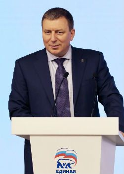

| Тип | Значение |
| - | - |
| Фамилия | Метельский |
| Имя и отчество | Андрей Николаевич |
| Партия | Единая Россия |
| Должность, описание | Секретарь Московского отделения партии «Единая Россия». Депутат Московской городской Думы третьего, четвёртого, пятого и шестого созывов.  |
| Официальный оклад | 455000 |
