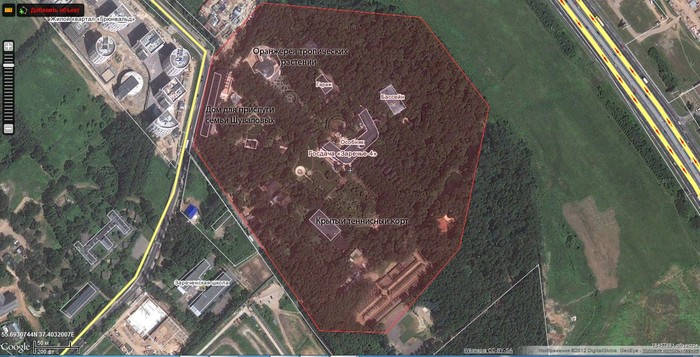

| Тип | Значение |
| - | - |
| тип | недвижимость |
| название | Дворец в Заречье |
| Оценка(руб) | 8000000000 |
| Локация | [MCV3+99 Заречье, Московская обл.](https://www.google.ru/maps/@58.0906562,40.3437635,6z) |
| Описание | Дворец Игоря Ивановича Шувалова в поселке Заречье находится на территории бывшей дачи Суслова. |
| Пруф | [https://www.youtube.com/watch?v=rbRoZyuOijk](https://www.youtube.com/watch?v=rbRoZyuOijk) |
| Кадастр | [50:20:0020202:104](https://egrp365.ru/map/?x=55.693764371412165&y=37.403345935330954&zoom=18&layer=2&ref=bq) |
