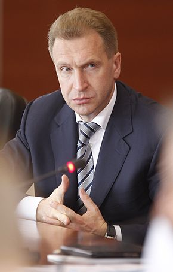

| Тип | Значение |
| - | - |
| Фамилия | Шувалов |
| Имя и отчество | Игорь Иванович |
| Партия | Единая Россия |
| Должность, описание | Председатель государственной корпорации «ВЭБ.РФ» 10 лет работал первым заместителем председателя Правительства Российской Федерации |
| Официальный оклад | 455 000 |
